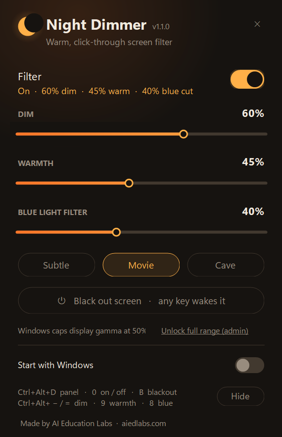

<p align="center">
  
</p>

<h1 align="center">Night Dimmer</h1>

<p align="center">
  Dim, warm and blue-filter your whole screen for night viewing on Windows.<br>
  Free and open source (MIT) from <a href="https://aiedlabs.com">AI Education Labs</a>.
</p>

---

Ever watched something at night and found your monitor's *lowest* brightness still too bright?
Night Dimmer goes darker than the hardware allows, adds an amber tone, cuts blue light, and can
black the screen out entirely until you touch a key — with a dark control panel, global hotkeys,
and presets. It's a single 1,000-line C# file with no
dependencies, and it compiles on your own PC in about two seconds.

## Install

Open **PowerShell** and paste:

```powershell
irm https://raw.githubusercontent.com/AI-Education-Labs/night-dimmer/main/install.ps1 | iex
```

That downloads the source, compiles it with the C# compiler already on every Windows 10/11 PC,
puts shortcuts on your desktop and Start menu, and launches it. No admin rights, no installer
wizard, no unsigned download for SmartScreen to complain about.

Prefer to look first? Clone the repo and run `install.ps1` from the folder — it'll use the local
files. Or just run `build.ps1` and use the exe where it lands.

**Uninstall:** `powershell -ExecutionPolicy Bypass -File "$env:LOCALAPPDATA\Programs\NightDimmer\uninstall.ps1"`

## Use

| | |
|---|---|
| Control panel | **Ctrl+Alt+D**, click the moon in the tray (either button), or the desktop shortcut |
| Filter on / off | **Ctrl+Alt+0** (or the toggle in the panel) |
| Darker / brighter, 5% steps | **Ctrl+Alt+-** / **Ctrl+Alt+=** |
| Cycle warmth | **Ctrl+Alt+9** |
| Cycle blue-light filter | **Ctrl+Alt+8** |
| **Black out the screen** | **Ctrl+Alt+B** or the panel button — *any key or click wakes it* (the key is swallowed, so Space won't unpause your video) |
| Quit | the **✕** in the panel's corner |

Alternate bindings if another app owns those: Ctrl+Alt+**PgDn / PgUp / End / Home**.

**Sliders.** *Dim* lowers brightness (0–90%; the dimmer itself never fully blacks out — that is what Blackout is for). *Warmth* shifts
the tone amber, like Night Light. *Blue light filter* cuts only the blue channel.
**Presets:** Subtle 30/20/20 · Movie 60/45/40 · Cave 85/65/60.

**Command line** — forwarded to the running instance, handy for scripts and scheduled tasks:

```
NightDimmer.exe --dim 70 --warmth 40 --blue 50
NightDimmer.exe --on | --off | --toggle | --blackout | --panel | --exit
```

## How it works

Two layers cooperate:

1. **Display gamma ramps** (`SetDeviceGammaRamp`) dim and tint the output signal itself, so
   *everything* is filtered — including the Alt+Tab switcher, Start menu and notifications,
   which sit above every normal window. Warmth and blue-cut here are multiplicative, so blacks
   stay black. Windows caps gamma at 50% brightness.
2. **A click-through, always-on-top overlay** per monitor makes up any dimming beyond that cap.

Gamma is restored the moment the app exits, crashes, sleeps or you sign out. Settings live in
`HKCU\Software\NightDimmer`; a small log is written to `%APPDATA%\NightDimmer.log`.

**Want the full range through gamma?** The panel offers *Unlock full range (admin)*, which sets
`GdiIcmGammaRange=256` in HKLM (one UAC prompt, then sign out/in). After that, dimming up to 90%
applies to Alt+Tab and friends too.

## Known limits

- Exclusive-fullscreen games and UAC prompts bypass the overlay (gamma still applies).
- Remote Desktop sessions usually don't support gamma; the overlay alone is used there.
- Windows 11 may put new tray icons in the `^` overflow; the app marks its icon "promoted", but
  if your taskbar auto-hides you'll need to hover the bottom edge — or just use Ctrl+Alt+D.

## Building

```powershell
powershell -ExecutionPolicy Bypass -File build.ps1   # -> NightDimmer.exe
```

Uses `csc.exe` from .NET Framework 4.x (present on all supported Windows versions). No SDK,
no NuGet, no Visual Studio required. Everything is in `NightDimmer.cs`.

## About

Made by [AI Education Labs](https://aiedlabs.com), who build AI tools for K-12 and higher
education — this one's a side project we found useful and wanted to share. Issues and pull
requests welcome.

MIT License · © 2026 AI Education Labs
